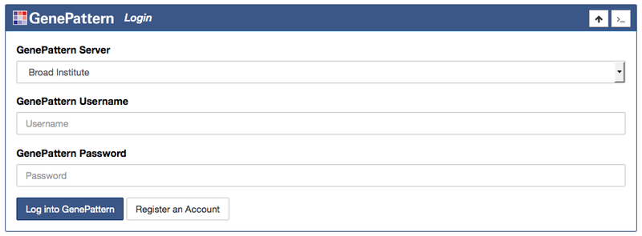
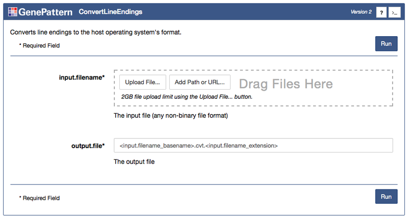

# Basic Features
--- 

!!! note
    These features are the most commonly used features in the GenePattern
    Notebook environment. They also form the building blocks for most
    advanced use cases.

## 1. GenePattern Cells

The GenePattern Notebook environment provides a number of graphical
widgets that make performing analyses easy, even for non-programming
users. These widgets take the form of *GenePattern Cells* that allow a
user to prepare analyses, launch jobs and visualize results.

To insert a GenePattern Cell, insert a new cell, either through the
*Insert &gt; Insert Cell Below* menu or by clicking the <i class="fa-plus fa"></i> button in the
notebook toolbar. Once a new cell has been inserted, you can select the
cell and then change the cell type to *GenePattern* either by using the
*Cell &gt; Cell Type &gt; GenePattern menu* or by going to the dropdown
menu in the notebook toolbar and selecting *GenePattern* from the list of
options.

### A. Authentication Cells

The first GenePattern cell that a user is likely to encounter is an
Authentication Cell. This cell allows a user to sign into a GenePattern
server. Doing this allows GenePattern to keep a user's results private,
and to remember a user's settings.

Authentication cells will look like a login form with the additional
option of selecting which GenePattern server to sign into. If the user
has already authenticated, such as when usng the GenePattern Notebook
Repository, the user will instead be prompted to either sign in as the
current user or to cancel and sign in as a different user

### B. Analysis Cells

After a user has signed in using an Authentication Cell, the next task
is usually to insert an Analysis Cell to perform an analysis. To do this
click the <i class="fa-th fa"></i> Tools button in the notebook toolbar. This wll open a dialog
box with a list of available GenePattern analyses. Search or browse
through the list and then click one of the options to insert an Analysis
Cell of that type.

Every Analysis Cell has a number of parameters, which can be used to
upload data and to select other options for the analysis. Once you fill
in these parameters, click  to submit them as a job on the
GenePattern server.

Once the  button has been clicked, all selected files will upload and
then a Job Cell will be inserted below to indicate the status of the job
in GenePattern’s queue (see Job Cells below).

### C. Analysis Jobs

Once an analysis is launched, a new job section will appear in the
analysis cell. This section represents the status of a job that has been
submitted to GenePattern queue for processing. Jobs progress through the
states of Pending, Running and finally either to Completed or Error.

Once a job has completed or experienced an error, the cell will update
to display a list of outputs. These outputs are files which can be
displayed in the browser, downloaded or sent as input to another
GenePattern analysis. Outputs are indicated by the <i class="fa fa-info-circle" style="color: rgb(128, 128, 128);"></i> icon.

To see a list of all output file options, simply click that output in
the list and a menu wll open, displaying the available options.

If this analysis includes visualization, the visualization will load and
appear inside the Job Cell as well.

Additional options, such as memory requirements, can be specified when
submitting a job. These options are hidden by default, but can be made
visible by going to the cell's Gear (<i class="fa fa-gear"></i>) menu and selecting Toggle Job
Options.

## 2. Markdown Cells

Markdown cells are another cell type available in the GenePattern
Notebook environment. They allow a notebook author to take notes,
document methods or embed images in a notebook document.

To insert a markdown cell, first insert a new cell, either through the
Insert &gt; Insert Cell Below menu or by clicking the <i class="fa-plus fa"></i> button in the
notebook toolbar. Once a new cell has been inserted, you can select the
cell and then change the cell type to Markdown either by using the Cell
&gt; Cell Type &gt; Markdown menu or by going to the dropdown menu in
the notebook toolbar and selecting Markdown from the list of options.

Markdown cells allow the user to format text using either [HTML](https://developer.mozilla.org/en-US/docs/Web/HTML) or the
[Markdown](https://daringfireball.net/projects/markdown/syntax) syntax. Additionally, we provide a "What You See is What You
Get" rich text editor (see the feature below).

## 3. Rich Text Editor

The GenePattern Rich Text Editor allows a user to format notes and
documentation in a notebook in much the same way that one might use
Microsoft Word or Libre Office — without the need to write a single HTML
tag or line of markdown.

To use the Rich Text Editor, first insert a markdown cell (see the
instructions above). Once a cell has been changed to the markdown type,
two buttons should appear to the left of the cell. The  button opens the
Rich Text Editor and the  button finalizes the cell and renders the text.

Click the  button and the editor will appear. A toolbar will show above
the cell, allowing the user to format text, insert headers or add links.
Style the text as desired, and when finished, click the  button to finish
editing.

## 4. Workflow Execution

A GenePattern notebook can be executed as an automated workflow. When
this happens, each cell is run in order, starting with the top. Code
cells execute their contained code. GenePattern analyses are launched
and the workflow waits for the analysis to complete before moving
forward. If an error is encountered - either as the result of a code
cell or the status of a GenePattern job - execution halts and waits for
user input.

By combining this feature with the [Job Result Syntax](http://genepattern-notebook.org/programmatic/#result-syntax) feature, a workflow
can be configured to run each step in sequence, taking the output of
upstream steps and sending the results as the input to downstream
analyses.

To run a GenePattern notebook as a workflow, first locate an
authentication cell and click on the gear menu. Select Run Notebook as
Workflow. A dialog box will pop up displaying the status of running the
workflow. Simply wait for execution to complete.

