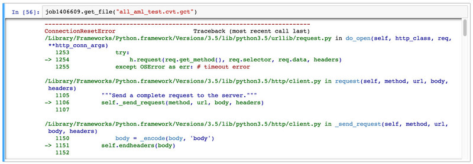

# FAQ
---

## Q: Is the GenePattern Notebook Worspace intended for use with Protected Health Information (PHI)?
The GenePattern Notebook Workspace is not intended for use with Protected Health Information (PHI). If you want to perform analyses with PHI data, please see our [instructions for running a private GenePattern Notebook instance.](https://gpnotebook-website-docs.readthedocs.io/en/latest/local-installation/)

## Q: How do I move notebooks or other files to different directories?

A: You can move a notebook or other file to another directory by
clicking the checkbox next to the file and then clicking the Rename
button. At the prompt, simply type the name of the directory you wish to
move the file to, followed by / (slash) and then the file’s name. For
example, to move the Emails.ipynb notebook the Example Notebooks
subdirectory, you would type Example Notebooks/Emails.ipynb. To move a
file to the parent directory, you would rename the file ../ and then the
file’s name. For example, if I wanted to move the Run an Analysis.ipynb
notebook up a directory, I would rename the file ../Run an
Analysis.ipynb.

## Q: I opened the notebook and I only see code.

A: If you ever load a notebook and see only code instead of your
GenePattern cells, this is an indicator that IPython/Jupyter has for
some reason failed to load the GenePattern Notebook extension.

This issue can be solved by executing the top code cell for GenePattern.
Simply select this cell and then select Cell &gt; Run from the menu. A
screenshot of the code for this cell is below.

## Q: I received a "Connection Reset by Peer" Error, what does it mean?

A: If you are attempting to programmatically connect to GenePattern and
receive a Connection Reset by Peer error, this is likely caused by your
Python environment using an outdated version of SSL/TLS. GenePattern
only accepts connections using TLS 1.2 or later.

To fix this issue you will need to update the version of OpenSSL used by
your operating system or Python installation. This is particularly an
issue with older versions of macOS. Instructions on how to update the
version of OpenSSL used by macOS can be found here.

## Q: Why is my home directory /home/jovyan?
The GenePattern Notebook workspace is based off the official Jupyter stacks Docker container. The Jupyter team has decided that jovyan is the default username in the stacks.