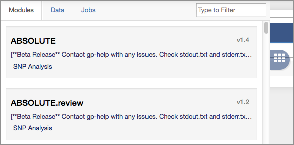

# Getting Started
---

!!! note 
    You can use the GenePattern Notebook environment by [registering for a GenePattern account](https://notebook.genepattern.org/) if you do not already have one, and logging into the [GenePattern Notebook Repository](https://notebook.genepattern.org/). This option requires no installation and provides the advantage of running your notebooks in the Amazon cloud. If you wish to install the GenePattern Notebook environment on a local machine, you can follow [these instructions](https://www.genepattern-notebook.org/install/).

## 1. Login to the GenePattern Notebook Repository

Open up the GenePattern Notebook Repository by visiting
<https://notebook.genepattern.org> and then log in with your GenePattern
account. If you do not have a GenePattern account you can sign up for
one by clicking the Register a New GenePattern Account button on the
right


## 2. Create a New GenePattern Notebook

On the page listing notebook files, look in the upper right and you
should see three buttons: Upload, New and a Refresh icon. Pull down the
New menu and select Notebooks &gt; Python 3. This will create a new
GenePattern notebook, which will open in a new browser tab. It should
look something like the screenshot below.

At the top of this page is a menu bar and toolbar for working with the
notebook. Below this is the notebook’s first cell. Python code can
executed from cells, documentation can be added and GenePattern widgets
can be entered to launch analyses. For general information on how to use
Jupyter notebooks, see the [Jupyter documentation](https://jupyter.org/).

## 3. Log into GenePattern

* Select any blank cell 
* Change that cell’s type to GenePattern using the
menu found in the Jupyter toolbar. You may be prompted to confirm that
you want to turn this cell into a GenePattern cell. This is expected.
* Once inserted, the cell will prompt you to select a GenePattern server,
as well as to enter a username and password. The default server to
select is the Broad-hosted GenePattern server,
<https://genepattern.broadinstitute.org>. 
* Once you have filled in these
fields, click Log into GenePattern. 

If one does not have a GenePattern
account, first select the server and then click Register an Account.


## 4. Begin an Analysis

Once you are logged in, a GenePattern button will appear on the left
side of the Notebook. This button is only visible when a GenePattern
cell is selected. Clicking this button will open a sliding menu, which
allows the user to select and run GenePattern analyses on the
GenePattern server.


You can search these analyses using the Type to Filter box found in the
upper right corner of the sliding menu. Once you have selected an
analysis, click it to add it as a cell in the notebook.



Every task has a number of parameters, which can be used to upload data
and to select other options for the analysis. Once you fill in these
parameters, click  to submit them as a job on the GenePattern server.


Once the  button has been clicked, all selected files will upload and
then the cell will change to indicate the status of the job in
GenePattern’s queue. Jobs progress through the states of Pending,
Running and finally either to Completed or Error.


## 5. Working with Results

When an analysis is completed, the cell will display the result files.
Clicking on one of these files will show a menu of options, such as
viewing the file, using the output programmatically in Python code or
sending the file to a downstream analysis. If an analysis resulted in an
error, it will present an error log. This file can be viewed to
determine what went wrong with the analysis.

Result files can only be sent to GenePattern cells which are ready to
accept input files.


The result file of one analysis can be easily be used as input for a
later analysis. Simply click the result file to open the menu, and
select either an existing downstream task or a new task. Clicking one of
these options will place the correct value for the result file into the
downstream form. In the case of sending to a new task, a new cell will
be created for the downstream analysis. Alternatively, result files can
also be dragged-and-dropped into the correct form.

## 6. Access in Python

Programmatic access to all GenePattern jobs and results is also
automatically available using GenePattern’s Python library. Any job
executed in a notebook can afterward be referenced using 
```

job

``` 
followed by the job number. For example, if a job is number 
```

1170434 

```
(such as in the screenshot above), the variable name would be job1170434 Entering this
into a code cell will return a reference to a GPJob object.

* For more information on using the GenePattern Python library, see the
[GenePattern Programmer’s Guide](http://www.broadinstitute.org/cancer/software/genepattern/programmers-guide#_Using_GenePattern_from_Python). 

Code examples of how to reference GenePattern jobs or GenePattern result files are available in the
notebook by clicking a job result and selecting “View Code Use” in the
menu.


