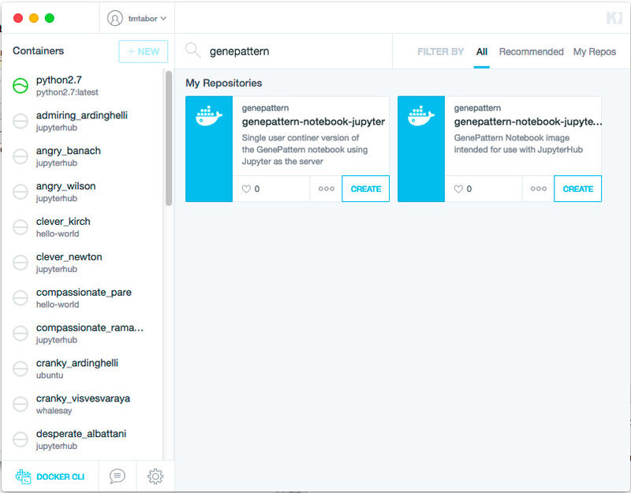
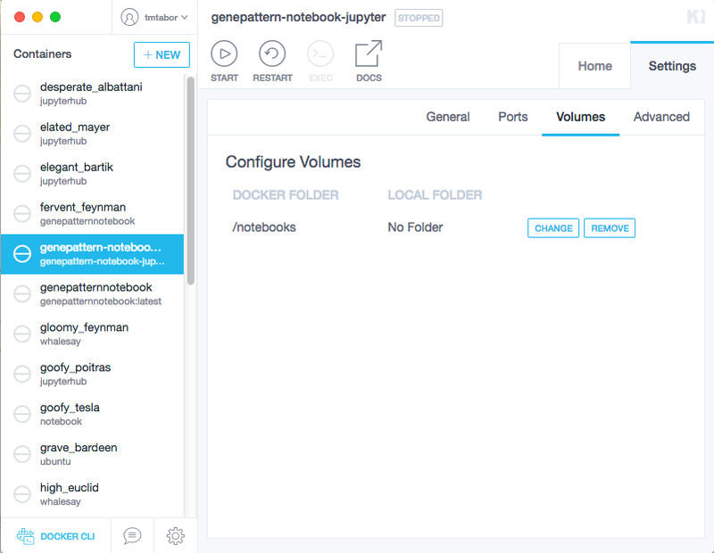
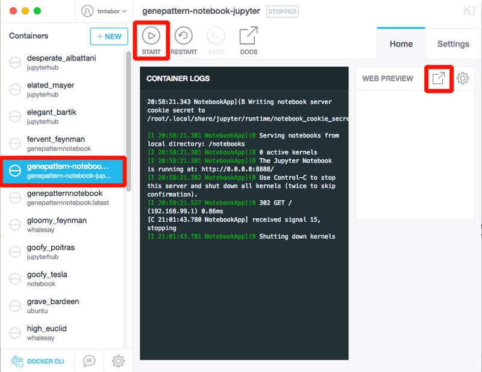
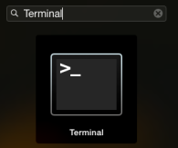

# Local Installation
---

!!! note 
    Local installation is only for those interested in running the GenePattern Notebook environment on their local machine. To use the online notebook, click on the "Login/Register" button above.

## Install GenePattern Notebook Using Docker (Recommended)
Installing GenePattern Notebook through Docker is the recommended means of installation, as it requires the least manual configuration.

### 1. Install Docker
To install the GenePattern Notebook environment using Docker, you will first need to download the Docker application. We recommend the free Community Edition. This application will manage the GenePattern Notebook environment and automatically perform any necessary configuration.

* [Download Docker here](https://store.docker.com/search?type=edition&offering=community)

Download Docker using the above link, then run the installer, following the directions when prompted.

### 2. Start Docker
Now you need to start the Docker application. If you’re using a Mac, open Applications and look for an icon called Docker. It looks like a whale. Click its icon to start the application.

The very first time you start Docker you may be asked if you wish to connect to DockerHub or Docker Cloud. Say yes. You may then be prompted to create an account. Follow the prompts as directed.

### 3. Download the GenePattern Notebook Image
Once Docker has finished starting, locate its whale icon in the application bar and click the icon to pull down a menu. Select Kitematic in the menu. This will open Docker's user interface.

Locate the search box in the window that opens and type the word “GenePattern” here to search for the correct GenePattern Notebook image.

The correct image will be named “genepattern-notebook” and above this it will have the organization name “genepattern.” Once this image is located, click the “Create” button to download and install the image. This will take a few minutes.



### 4. Set a Volume (Optional)
By default, any notebooks a user creates will be saved inside the Docker image. A user wanting access to these notebook files outside of the image is advised to “set a volume.” This allows the user to select a folder on their hard drive. This folder will be available inside the notebook environment, and all notebooks the user creates will be saved there.

To set a volume, once the installation is completed, a container named “genepattern-notebook” will show up in the list on the lefthand side of the Kitematic application. Click this item in the list to select it. Afterward, select the Settings tab on the far right and then select Volumes. This will present the user with the option to set a local folder. Click the Change button and then select the desired folder.



### 5. Start the Image
Once the installation is completed, a container named “genepattern-notebook” will show up in the list on the lefthand side of the Kitematic application. Click this item in the list to select it.

The image may automatically start. If this is the case, the Start button will be grayed out. If it is not grayed out, go ahead and click the Start button at the top of the image.

Give the image a few seconds to start and then click the “popout” button to the right of “Web Preview” to open GenePattern Notebook.



### What’s Next?
* [Using GenePattern Notebook](http://notebook.genepattern.org/user-guide/)

## Install GenePattern Notebook Manually
This method of installing the GenePattern Notebook Environment will set it up natively on your computer. This will require configuring the computer’s Python environment. It is recommended only for users who are familiar with the command line.

The instructions below will require you to type commands into a terminal window. Mac users can access the terminal window through the following:

* Click the Launchpad icon in your dock: 
* In the Search bar, type Terminal, and then click on the Terminal icon: 



### 1. Install Python and required tools
Before the GenePattern Notebook extension can be used, the Python programming language must be installed. While Macs come with Python pre-installed, we recommend the [Anaconda](http://continuum.io/downloads#27) distribution of Python from Continuum Analytics, as this distribution comes with **`pip`**, Jupyter and other necessary packages, as well as a variety of other packages useful in scientific computing. You can install the Anaconda package without interfering with other versions of Python on your system.

To install the Anaconda distribution

- Go to [https://www.anaconda.com/distribution/](https://www.anaconda.com/distribution/)
- Select your operating system
- Download and run the installer.

To install the required tools individually (not required if you install Anaconda)

If you are using a distribution of Python that does not come with the **`pip`** utility, it must first be installed. To install **`pip`**:

* Download the installation script ([click here](http://bootstrap.pypa.io/get-pip.py))
* Open a terminal window (see above for instructions)
* Navigate to the directory where you downloaded the installation script
* Tun the installation script by entering the following command into the terminal
```

python get-pip.py

```

!!! note
    To install **`pip`** you may need administrator permissions, such as running the above command using the **`sudo`** (Linux, Mac) or **`runas`** (Windows) utilities. If you try the above command and receive a message that you do not have permissions to execute it, type
```

sudo python get-pip.py

```
and type your password when prompted.

**Install Jupyter and IPyWidgets**

Jupyter and its widget library can be installed from the Python Package Index by entering the following command into the terminal:
```

pip install jupyter ipywidgets

```
!!! note
    To install a package from PIP you may need administrator permissions, such as running the above command using the **`sudo`** (Linux, Mac) or **`runas`** (Windows) utilities.

### 2. Install the GenePattern Notebook extension
The GenePattern Notebook extension can be installed from the **`pip`** package manager by entering the following command into the terminal:
```

pip install genepattern-notebook

```
!!! note
    To install a package using **`pip`** you may need administrator permissions, such as running the above command using the **`sudo`** (Linux, Mac) or **`runas`** (Windows) utilities. You may also need to restart your terminal window, if you have only just installed Anaconda.

Finally, you will need to enable the extension by entering the following command into the terminal:
```

jupyter nbextension enable --py widgetsnbextension
jupyter nbextension install --py genepattern
jupyter nbextension enable --py genepattern
jupyter serverextension enable --py genepattern
jupyter nbextension install --py nbtools
jupyter nbextension enable --py nbtools
jupyter serverextension enable --py nbtools

```

### 3. Launch Jupyter
To run Jupyter (Mac users):

* Open a terminal window (if you do not know how to open a terminal window, see the top of the [installation instructions](http://software.broadinstitute.org/cancer/software/genepattern/genepattern-notebooks-installation))
* At the prompt, type the following command and then hit Enter:
```

jupyter notebook

```
This will start the notebook server and open the notebook application in your web browser. This should direct you to a page that lists all of the files in your home directory. You can create folders or open any existing notebook files from this page.

If your browser did not open, you can alternatively direct your browser to Jupyter notebook by pasting the following URL into the location bar:
```

http://localhost:8888/

```
Once the Jupyter notebook environment is open in your browser, it should look similar to the screenshot below.


## Updating GenePattern Notebook
GenePattern Notebook is updated regularly with new releases. To update your version of GenePattern Notebook, run the following in the terminal:
```

pip install --upgrade genepattern-notebook

```
Mac users can access the terminal window through the following:

* Click the Launchpad icon in your dock: 
* In the Search bar, type Terminal, and then click on the Terminal icon: 


## What’s Next?
* [Using GenePattern Notebook](http://genepattern-notebook.org/user-guide/)

##Compatibility Notes
* **Python:** GenePattern Notebook supports Python 3.4+.
* **Jupyter:** The GenePattern Notebook extension was developed and tested with Jupyter 5.7.
* **Browser:** GenePattern Notebook supports Chrome, Firefox and Safari.
