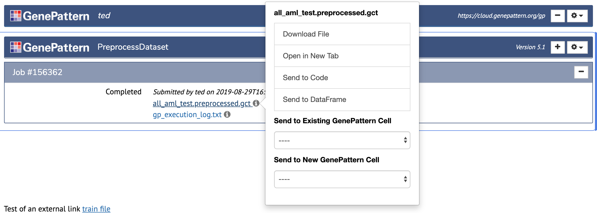
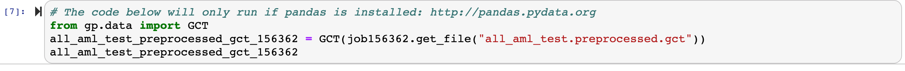
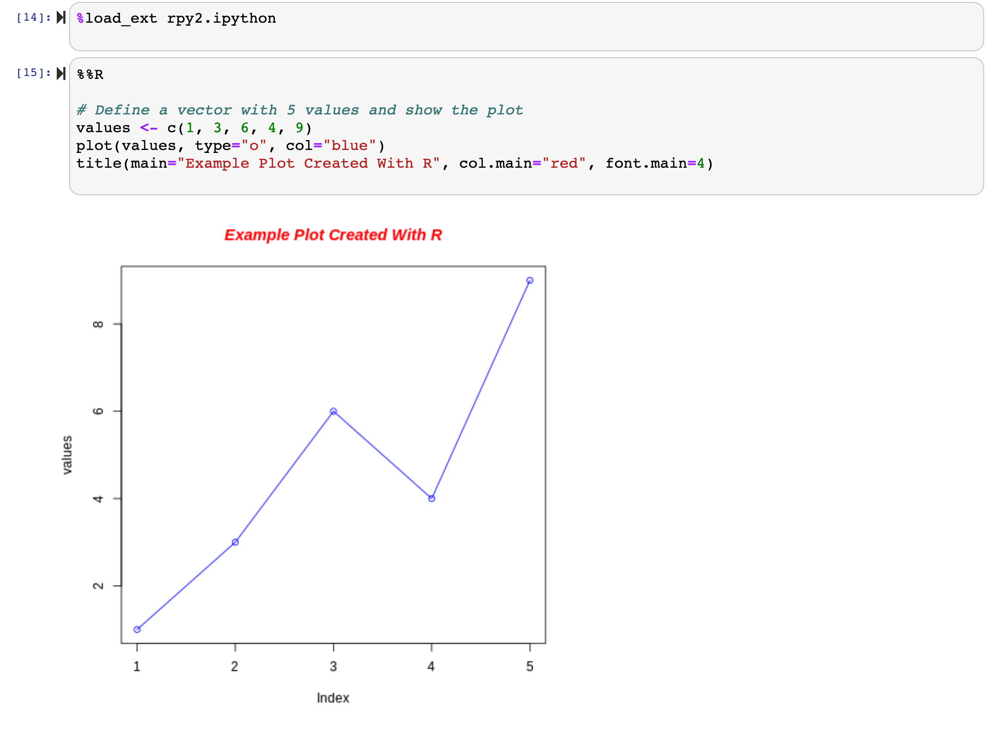
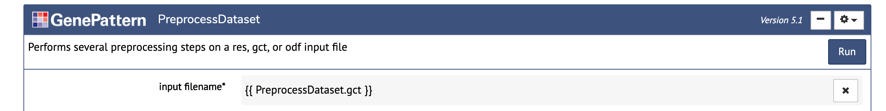
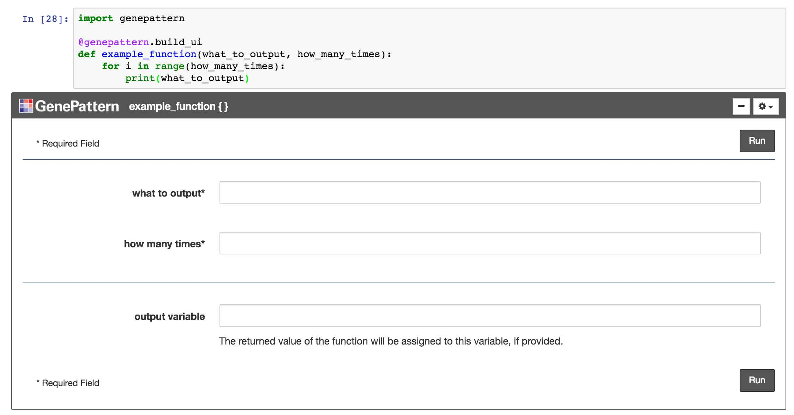
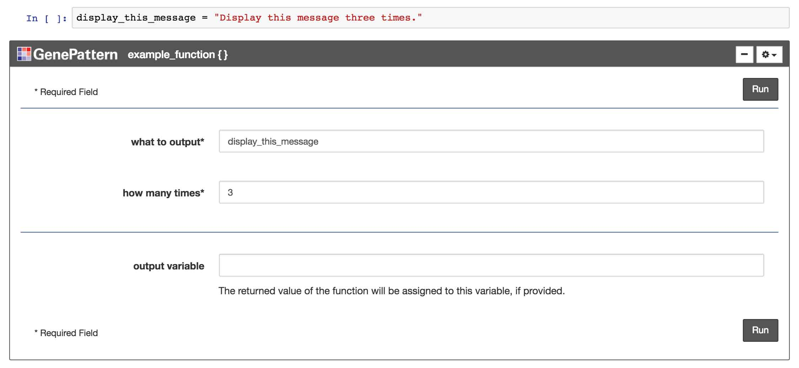
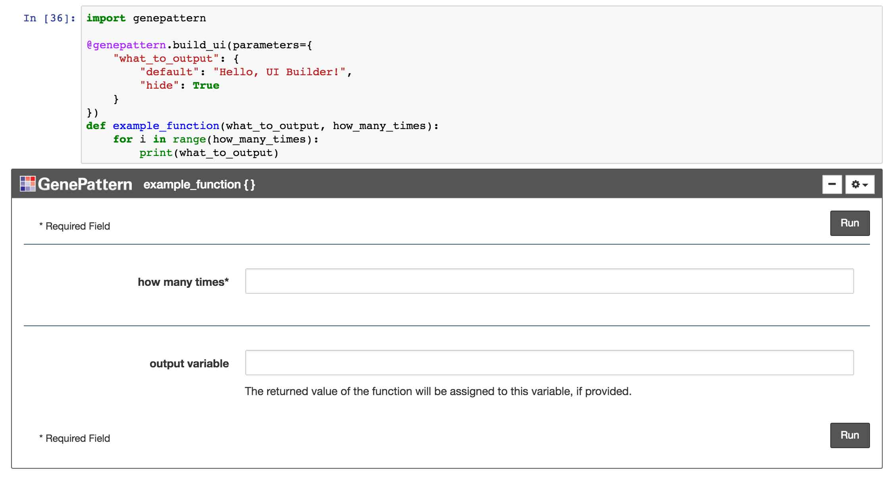

# Programmatic Features
---

!!! note
    In addition to the basic and publishing features intended for use by both non-programming and programming users alike, the GenePattern Notebook environment also provides a variety of features intended primarily for use by coders.

## Programmatic Features

### 1. Code Cells
Code cells allow a user to type in execute Python code. They are the default type of cell. Simply enter the Python code you want to run and then click the  (run cell) button in the notebook toolbar.

More information on code cells and their variousoptions is available in the [Jupyter documentation](https://jupyter.readthedocs.io/en/latest/).

### 2. GenePattern Python Library
A library is available for using Python to interact with available GenePattern's service. This allows a user to programmatically prepare analyses, launch jobs and retrieve results.

A complete tutorial on using the GenePattern Python Library is available as a public notebook in the [GenePattern Notebook Repository](https://notebook.genepattern.org/services/sharing/notebooks/362/preview/). Additional information is available in our published [example notebooks](https://github.com/genepattern/example-notebooks/tree/master/Example%20Notebooks) on GitHub.

### 3. Send to Code
The GenePattern Python Library seamlessly integrates with GenePattern cells. Code examples of how to reference GenePattern jobs or GenePattern result files are available in GenePattern Job Cells by clicking a job result and selecting “Send to Code” in the menu.



This will add a new cell below prefilled with the python to retrieve the file as a GPFile object from the GenePattern Python Library.


### 4. Send to Dataframe
The GenePattern Python Library also provides functionality for common GenePattern file formats, allowing them seamlessly integrate with [Pandas](http://pandas.pydata.org/), a popular Python data analysis library.

Both the [GCT and ODF file formats](http://software.broadinstitute.org/cancer/software/genepattern/file-formats-guide) are easily loaded as Pandas Dataframes. Code examples of how to load these files are available in GenePattern Job Cells by clicking a GCT or ODF job result and selecting “Send to Dataframe” in the menu.




### 5. Python Variable Input
As part of the seamless integration between Python and GenePattern, Python variables may be directly used as input in GenePattern Analysis Cells. To use a Python variable as input, first define the variable in a code cell, then in a GenePattern Analysis cell, enter the variable name surrounded by two sets of curly brackets. For example, using the variable
```

foo

```
would appear as
```

{{ foo }}

```
When the Run button is clicked to launch the analysis job, the notebook will first obtain the value of the variable used as input and then send that to the GenePattern server. As the GenePattern services expect a string, non-string variables will be cast as strings when they are evaluated.

### 6. R Support
The GenePattern Notebook Environment supports R through the use of R magic commands. To begin using R magics, you first need to load the R magics extension. This can be achieved by running the following code within your notebook:
```python

%load_ext rpy2.ipython

```
After the extension has been loaded, beginning a cell with
```

%%R

```
will tell the notebook environment to execute the rest of the code in the cell using R rather than Python. An example is given below.



### 7. Job Result Syntax
When specifying the input to a GenePattern analysis cell, a simple syntax can be used to select the output of a upstream job. To do this, inside double curly brackets, write the name of the GenePattern module and extension of the output file separated by a period. If multiple jobs exist in the notebook using that module, or multiple files are returned of that type, an index can optionally be specified in square brackets. Several examples are given below.
```

{{ PreprocessDataset.gct }}

```
Use the first GCT file output by the first PreprocessDataset job in the notebook.
```

{{ PreprocessDataset[1].gct[1] }}

```
This is functionally the same as the first example, but the index is made explicit for both which PreprocessDataset job in the notebook to use and which GCT file to use.
```

{{ PCA[2].odf }}

```
Use the first ODF file output by the second PCA job.
```

{{ FlowMeansCluster.csv[3] }}

```
Use the third CSV file output by the first FlowMeansCluster job.

Note that unlike python variables which also use the ```{{ }}```  syntax, referencing GenePattern Job outputs in this manner only works within the interface for a GenePattern analysis or  [UI Builder](#ui-builder) interface, and cannot be used directly in code cells.  e.g.




### 8. Files in Markdown Cells
Sometimes it is beneficial to the narrative of a notebook to link to externally-hosted files in a markdown cell and then to use those files in a later programmatic step.

GenePattern Notebook makes doing this easy. Just give the link to the external file the nbtools-markdown-file class and the external file will automatically appear as an option in GenePattern Notebook's file menus. An example is given below.
```html

<a class="nbtools-markdown-file" href="http://example.url">The text to link here.</a>

```
An alternative is to make your links appear in a notebook looking like the [UI Builder](#ui-builder) output  from a remote GenePattern job.  To do this, give an array of 1 or more links to the genepattern.GPUIOutput() method and return it at the end of a cell.  An example (with code also displayed) is shown below.


### 9. Installing Packages
While the GenePattern Notebook Workspace comes with many popular bioinformatic and machine learning packages already installed, it also
provides the ability to customize your workspace by installing new libraries. Behind the scenes, each kernel in the GenePattern Notebook Workspace is encapsulated in a conda environment. To install a new library, simply activate the appropriate environment and then install the package through either the PIP or conda package managers.

#### Conda Environments
To activate a conda environment, open a new terminal and then enter one of the following lines, as appropriate for your notebook's
environment. Since the Python 3.7 kernel is used by default, if there is any doubt, activate that environment.

```

source activate python3.7
source activate python3.6

```

#### Installing Through PIP
Once the correct conda environment has been activated, installing new packages through PIP is as easy as adding the <em>--user</em> parameter to the PIP command. (You may need to shut down and restart your notebook if it was opened before the library was installed.)
```

pip install --user <package_name>

```

#### Installing Through Conda
Installing packages through conda requires one additional step. You must first tell conda where to install new packages, then you can install       them using a simple <em>conda install</em> command. See the commands below.</p>

Without this additional <em>conda config</em> command, packages will install successfully, but will be lost each time you log in.

```

conda config --add pkgs_dirs ~/.local/lib/python3.7/site-packages
conda install <package_name>
                
```

## Globus Connect
[Globus](https://www.globus.org/) is a way to synchronize the files in your GenePattern Notebook user directory with those on your personal computer or elsewhere.

To use Globus Connect, you will first need to sign up for a free [Globus account](https://app.globus.org/). You will also need to log in to the Globus file manager and create a personal endpoint.

This can accomplished by selecting "Endpoints" from the [Globus interface](https://app.globus.org/) and then clicking "Create a Personal Endpoint" in the upper right. Give this new endpoint a name like "GenePattern Notebook" and then click the "Generate Setup Key" button. Copy and save this key.

Inside GenePattern Notebook, open a new terminal and then set up your Globus endpoint by running:
```

/opt/gcp/globusconnectpersonal -setup <GENERATED_KEY> -dir ~

```
This will create the configuration needed to synchronize your GenePattern Notebook user directory. Finally, to begin the Globus synchronization, run the following command:
```

/opt/gcp/globusconnectpersonal -start -dir ~

```
As long as this process is running, Globus will continue to synchronize your files between GenePattern Notebook and any other connected endpoint. For more information, see the [Globus documentation](https://docs.globus.org/).


## UI Builder
---

The UI Builder is a way to display any Python function or method call as an interactive widget. This will render the parameters of the function as a web form.

The UI Builder will use any existing docstring for the function as a description, will infer parameter types from default values and will display parameter annotations as helpful text near each input.



### 1. Build the UI
The simplest way to render a function using the UI Builder is to import the genepattern package and then attach the build_ui decorator to the function's definition. A code example for this is given below:
```python

import genepattern

@genepattern.build_ui
def example_function(first_parameter, second_parameter):
    . . .

```
Alternatively, the UI Builder widget may defined and referenced directly. To render a function in this way, simply import the GPUIBuilder class from the genepattern package and pass the function to the GPUIBuilder constructor. To display the widget, just return the GPUIBuilder object in a Jupyter code cell. A code example is provided below:
```python

from genepattern import GPUIBuilder

def example_function(first_parameter, second_parameter):
    . . .

# Create the GPUIBuilder object and immediately
# return it for display in Jupyter
GPUIBuilder(example_function)

```
### 2. Python Variables & String Literals
Python variables may be used as input when filling out a UI Builder form. To do this, simply type the name of the variable into the input field. When the form is submitted, the widget will pass a reference to the variable to the resulting function call.



Conversely, to ensure that an input value is evaluated as a string literal rather than a variable name, a user can wrap the input to a particular field in either single or double quotes (' or "). This tells the UI Builder to skip checking for variable names and to treat the value in quotes as a literal string. For example, forcing the string foo to be treated as a string literal would be entered in the input field as:
```

"foo"

```

### 3. String Serialization
The input to a UI Builder form may include a string representation of a variable's value rather than a reference to the variable itself. This is useful for embedding the value inside a larger string, or when passing a variable reference would be unwanted.

This functionality can be achieved by placing the variable name inside double curly brackets. For example, embedding the string serialization of the variable foo would be entered into an input field as:
```

{{ foo }}

```


### 4. Rendering Existing Functions
Existing Python functions, such as those included in third-party Python libraries, can also be used with the UI Builder. To display an existing function first import it and then pass the function into the constructor of the GPUIBuilder object. Return this object in a cell to display the resulting widget. For example, the code for displaying scikit-learn's KMeans function is given below.
```python

import genepattern
import sklearn.cluster

genepattern.GPUIBuilder(sklearn.cluster.KMeans)

```

### 5. Overriding Properties
By default, the widget name will be the function name, the description will be the docstring of the function and the parameter names will be the same as the parameters defined in the code. All of these, however, can be manually overridden. This is particularly useful whe providing better names or descriptions that users would find helpful.

To override the default values, optional parameters may be passed into the build_ui decorator or into the GPUIBuilder constructor. Examples overriding the widget name and description are given below.

The bottom example also demonstrates overriding the canonical name of the function being rendered. This is sometimes helpful if the function has been imported into the code in a non-top level namespace.
```

@genepattern.build_ui(name="Simple Example",
                      description="This is an example function.")
def example_function(param_1, param_2):
    . . .

```
The same effect can be also achieved when directly instantiating the GPUIBuilder object.
```

genepattern.GPUIBuilder(sklearn.cluster.KMeans,
                        name="KMeans Clustering",
                        description="Groups data into K clusters",
                        function_import="sklearn.cluster.KMeans")

```


### 6. Overriding Parameters
The names and descriptions of individual parameters may also be overridden. In this case, a dictionary may be passed to the build_ui decorator or the GPUIBuilder constructor with the parameter's name as the key and the properties to override as the value.

A code example is given below which overrides the name of a parameter, the description of the parameter and the default value of the parameter.
```python

@genepattern.build_ui(parameters={
    "param_1": {
        "name": "foo",
        "description": "This parameter has been renamed.",
        "default": "bar",
        "optional": True
    }
})
def example_function(param_1, param_2):
    ...

```


### 7. Hiding Parameters
Sometimes a particular function has parameters that shouldn't be changed in the current context. The UI Builder has the ability to hide the input for these parameters, simplifying the user interface and allowing users to focus only on the relevant inputs. When the function is called, the hidden parameters will automatically use their default values. This may be combined with overriding the default value for the parameter in question in order to force a particular input.

A code example is given below in which several parameters of scikit-learn's KMeans implementation are hidden.
```

genepattern.GPUIBuilder(sklearn.cluster.KMeans, parameters={
    "init": { "hide": True },
    "verbose": { "hide": True },
    "random_state": { "hide": True, "default": 1234 },
    "copy_x": { "hide": True }
})

```

### 8. Output Variable
The result of a UI Builder function can optionally be assigned to a Python variable. By default, a text field for this variable will appear at the bottom of each UI Builder widget. This field can be overridden just like any other parameter using the output_var parameter name. This includes the ability to change the label, description, assign a default value or hide the parameter. A code example is given below.
```

@genepattern.build_ui(parameters={
    "output_var": {
        "name": "results",
        "description": "The results of the function",
        "default": "variable_name",
        "hide": False,
    }
})
def example_function(a_text_param, a_number_param,
                     a_password_param, a_bool_param=True):
    . . .

```
### 9. Parameter Types
The UI Builder supports a number of parameter types and implements features to make handling those types easier. Supported types include:

* **Text:** Supports any text value. Unless referencing an existing Python variable, any input gets cast to a Python string value. Text is also the default parameter type if no other type information has been specified or can be determined.
* **Number:** Accepts any numerical value and renders in a notebook as an HTML number input.
* **Password:** Works exactly like a text input, but obfuscates the input value as a password field.
* **Choice:** When provided with a list of choices, this input will render as a dropdown parameter, with the default value selected. Choice parameters are described in their own section below.
* **Bool:** A boolean input representing True and False. Renders as a choice parameter with those two choices.
* **File:** An input intended to receive a file or file-like object. File parameters are described in their own section below.

The UI Builder will infer a parameter's type from its default value, defaulting to a text parameter if no value is available or if the default value's type doesn't match one of the known types above. Alternatively, the developer can specify a parameter's type in the code. A code example is provided below, illustrating how to specify each type - except for choice and file parameters, which are each detailed in their own sections.
```

@genepattern.build_ui(parameters={
    "a_text_param": {
        "type": "text"
    },
    "a_number_param": {
        "type": "number"
    },
    "a_password_param": {
        "type": "password"
    },
    "a_bool_param": {
        "type": "bool"
    },
})
def example_function(a_text_param, a_number_param,
                     a_password_param, a_bool_param=True):
    . . .

```

### 10. Choice Parameters
Sometimes a parameter only accepts a limited set of valid input values. This is often represented in a user interface as a dropdown (select) input. The UI Builder has support for this functionality. To change a particular parameter into a dropdown input, simply provide the parameter with a dictionary of available choices. A code example is given below.
```

@genepattern.build_ui(parameters={
    "param_1": {
        "default": "some_value",
        "type": "choice",
        "choices": {
            "foo label": "foo value",
            "bar label": "bar value",
            "some_label": "some_value"
        }
    }
})
def example_function(param_1, param_2):
    . . .

```

### 11. File Parameters
File parameters are intended to handle input representing a file or file-like object. They are integrated with GenePattern job widgets, such that available GenePattern files will appear in a menu when a file parameter is first selected, thereby allowing the user to easily select the desired file.

Optionally, the developer can specify the kinds of files that a file parameter accepts. This is accomplished by providing a list of file extension strings. For example, a parameter that expects a gct, odf or res files would list: ["gct", "odf", "res"].

It is worth noting that when a GenePattern file is selected in the menu, the value provided to the function will actually be a string containing a URL to the specified file. The developer may then take this string and use it to create a file-like object, pass it to a function that will download the file or otherwise perform any desired tasks.

A code example is provided below.
```

@genepattern.build_ui(parameters={
    "param_1": {
        "type": "file",
        "kinds": ["gct", "odf"]
    }
})
def example_function(param_1, param_2):
    . . .

```


Similar to choice parameters, a file parameter may likewise be given a list of possible options. These options will appear in a dropdown when the parameter it selected.
```

@genepattern.build_ui(parameters={
    "param_1": {
        "type": "file",
        "choices": {
            "Example Label #1": "ftp://fake.example.com/example_1.csv",
            "Example Label #2": "ftp://fake.example.com/example2.csv",
            "Example Label #3": "ftp://fake.example.com/example_3.csv"
        }
    }
})
def file_choice_example(param_1):
    . . .

```

### 12. Client-side Interactivity
Notebook authors who wish to integrate the UI Builder with client-side programmatic functionality can make use of the id and events attribute of parameters.

The id attribute allows the author to specify an ID for the parameter's element in the DOM. As with all DOM IDs, it must be both unique and [adhere to the naming rules in the HTML specification](https://developer.mozilla.org/en-US/docs/Web/HTML/Global_attributes/id).

The events attribute allows the author to attach Javascript functionality to the parameter. It should be specified as a dict, where the keys are Javascript events and the values are strings containing the Javascript code to be executed.

An example of using both of these attributes is given below.
```

@nbtools.build_ui(parameters={
    "param_1": {
        "id": "example_function_param_1",
        "events": {
            "click": "console.log('Hello World!');"
        }
    }
})
def example_function(first_parameter, second_parameter):
    . . .

```
Additionally, the top-level events attribute is available for handling events associated with the UI Builder widget itself, rather than individual parameters. This accepts a dictionary pairing event names to strings containing Javscript to be executed when the event occurs. Supported events are presented below:

* **load:** Executed when the widget is initialized.
* **run:** Event fires when the Run button is clicked.
* **click:** Executed when the widget is clicked.
* **focus:** Event fires when the widget obtains focus.
```

@nbtools.build_ui(
    events={
        "load": "console.log('Write to the Javascript console when the widget is loaded.')",
        "run": "console.log('Write to the Javascript console when the Run button is clicked.')"
    }
)
def example_function(first_parameter, second_parameter):
    . . .
```

### 13. Send to Text
Specific text options can be made easily accessible from a text input by annotating them with the nbtools-text-option class. Any text annotated in this way will appear in a dropdown whenever a text input parameter is selected.
```html

<span class="nbtools-text-option">Text to send to parameter</span>

```
### 14. Other Options
The following minor features are available available in the UI Builder.

* **register_tool:** Sets whether to register this function with the Notebook Tool Manager. Defaults to True.
* **collapse:** Sets whether to collapse the UI Builder widget when the function is run. Defaults to True.
* **function_import:** Override the import name of an existing function.
* **origin:** Override the name of the tab the tool appears in. Defaults to either "Notebook" or the name of the module the tool is imported from.
```

@nbtools.build_ui(register_tool=False, collapse=False, function_import='example_package.example_function')
def example_function(first_parameter, second_parameter):
    . . .

```

## R Support
The UI Builder can be used to wrap R code in conjunction with a special R cell magic. Unlike with Python code, however, the UI Builder does not have the ability to introspect and automatically generate a form from an R function. Instead, a notebook author must pass the magic a spec in the form of a dict, listing the name of the UI Builder widget and the parameters. This spec mirrors the structure of the dict passed into the @nbtools.build_ui decorator. When executing the R code, any parameters in the UI Builder end up as global variables in the R script's memory space. The return value of the cell is passed back to Python as the value of the output variable.

A code example is below.
```

%load_ext nbtools.r_support

```
```

%%r_build_ui { "name": "R Example", "parameters": { "param_from_ui_builder": { "type": "number" } } }

example_func <- function(first_parameter) {
    return (first_parameter)
}

example_func(param_from_ui_builder)

```
Note that the spec may also be defined as a Python dict and then included in the magic cell using the $ notation. For example:
```

spec = {
    "name": "R Example",
    "parameters": {
        "param_from_ui_builder": {
            "type": "number"
        }
    }
}

```
```

%%r_build_ui $spec

example_func <- function(first_parameter) {
    return (first_parameter)
}

example_func(param_from_ui_builder)

```
## UI Output
---

UIOutput is a widget that can be created programmatically and displayed as the output to a UI Builder cell or any code cell. It's intended to display results in a fashion similar to a GenePattern analysis cell, thereby providing a consistent user interface.

### 1. Create the widget
The simplest way to create a UIOutput widget is to import the widget and then call the constructor.:
```python

import nbtools

genepattern.UIOutput()

```
### 2. Specify Parameters
The UIOutput widget supports a number of parameters, which should be set to present as output. Options include:

* **description:** A text blurb describing what is being output.
* **files:** A list of URLs to files being output by the widget.
* **name:** A name to display in the header of the widget.
* **status:** A terse indicator of the output status. Can be dynamically updated as an analysis progresses (see below).
* **text:** Intended for long text output, such as logging or other information.

### 3. Dynamically Updating Status
The status of a UIOutput widget can be dynamically updated by setting the status property of the widget object. This is useful for long-running analyses and allows a function to alert the user when an analysis is complete, or when a new stage of analysis has been reached.
```

import nbtools

uio = genepattern.UIOutput(status="Running")
# Perform long-running analysis here
uio.status = "Complete"

```                
